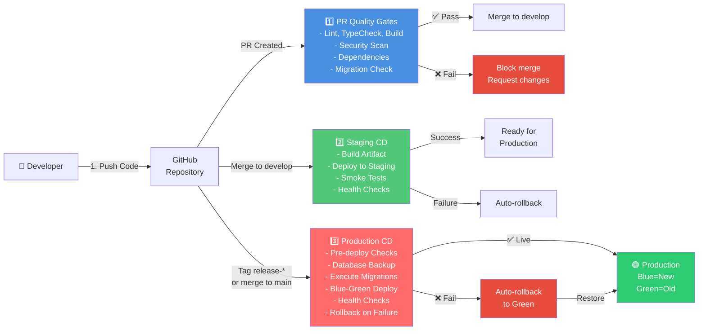

# CI/CD Architecture & Deployment Flow

## RFC Compliance Foundation

This CI/CD architecture must comply with RFC-0001 (Data-First AI Platform Strategy).

Governance references:

- `docs/Data-First AI Platform-Strategy.md` (RFC-0001)
- `docs/RFC-GOVERNANCE.md`
- `docs/RFC-TEMPLATE.md`

## System Architecture Overview



---

## Workflow Phases

### Phase 1: Pull Request Quality Gates
**Trigger**: When PR opened or updated  
**Duration**: ~5-10 minutes  
**Decision**: Merge allowed or blocked

#### Jobs (Parallel Execution)
1. **Lint & Code Quality** (1-2 min)
   - ESLint checks
   - Code style verification
   - Produces: lint report

2. **Type Safety** (1-2 min)
   - TypeScript compiler
   - Type checking
   - Produces: tsc errors/warnings

3. **Unit Tests** (2-3 min)
   - Jest/Vitest runner
   - Code coverage
   - Produces: test results

4. **Build Artifact** (2-3 min)
   - Next.js build
   - Verifies compilability
   - Produces: .next artifact

5. **Dependency Vulnerability Scan** (1-2 min)
   - npm audit
   - CVE database check
   - Produces: audit report

6. **Secret Scanning** (1-2 min)
   - TruffleHog (credentials)
   - GitGuardian (secrets)
   - Produces: scan results

7. **Database Migration Check** (1 min)
   - Validates migration SQL syntax
   - Checks for destructive patterns
   - Verifies safety metadata
   - Produces: migration report

#### Exit Criteria
✅ All jobs succeed  
❌ Any job fails → PR cannot merge  
⏭️  Stale approvals dismissed on new commits

#### Output
- ✅ PR status badge (all green = ready to merge)
- 📊 Comment with gate summary
- 🔗 Links to full reports (build, audit, tests)

---

### Phase 2: Staging Continuous Deployment
**Trigger**: Merge to `develop` branch  
**Duration**: ~10-15 minutes  
**Decision**: Proceed to production or stop

#### Jobs (Sequential with Checkpoints)
1. **Build Staging Artifact** (2-3 min)
   - Compile with staging env flags
   - Produces: build-staging artifact

2. **Database Migration Dry-Run** (1-2 min)
   - Collect pending migrations
   - Validate syntax & safety
   - Produces: migration report

3. **Deploy to Staging** (2-3 min)
   - Download build artifact
   - Deploy to staging.example.com
   - Update DNS (if needed)
   - Produces: deployment log

4. **Smoke Tests** (2-3 min)
   - Health endpoint check
   - Auth sanity test
   - API endpoints test
   - Produces: test results

5. **Health Check** (1-2 min)
   - Verify app responding
   - Database connectivity
   - All services up
   - Produces: health report

#### Exit Criteria
✅ All tests pass → Staging ready for QA  
❌ Failure at any step → Auto-rollback + alert  
📧 Notify team of status

#### Output
- 📊 Deployment summary (SHA, branch, time)
- 🔗 Staging URL for manual QA
- ⚠️ Alerts if tests fail

---

### Phase 3: Production Continuous Deployment
**Trigger**: Tag `release-*` or merge to `main` + approval  
**Duration**: ~20-30 minutes (with safeguards)  
**Decision**: Live, rollback, or pause

#### Jobs (Sequential with Safety Stops)

**Step 1: Pre-Deployment Validation** (2 min)
- Verify branch/tag eligible for production
- Check all CI checks from main passed
- Verify no concurrent deployments
- Produces: pre-flight report

**Step 2: Database Backup & Checkpoint** (2-3 min)
- Create pre-deployment backup
- Snapshot database state
- Produces: backup-ID for rollback

**Step 3: Execute Migrations** (3-5 min)
- Validate migration safety
- Apply backward-compatible migrations
- Validate results
- Produces: migration result

**Step 4: Build Production Artifact** (2-3 min)
- Build with production flags
- Verify artifact integrity
- Produces: prod build

**Step 5: Blue-Green Deployment** (2-3 min)
- Deploy to BLUE (new version)
- Verify BLUE startup
- Produces: deployment log

**Step 6: Health Checks on BLUE** (1-2 min)
- Verify app responding
- Check all endpoints
- Produces: health report

**Step 7: Smoke Tests on BLUE** (1-2 min)
- Run critical flow tests
- Produces: test report

**Step 8: Traffic Switch** (1 min)
- Load balancer: GREEN → BLUE
- DNS/CDN update (if needed)
- Produces: switch log

**Step 9: Post-Switch Monitoring** (5 min)
- Monitor error rate, latency
- Check for anomalies
- Produces: monitoring snapshot

#### Exit Criteria
✅ All steps succeed → Production LIVE (Blue environment)  
❌ Failure at any step → Auto-rollback + alert  
🚨 Manual intervention available at each checkpoint

#### Output
- 📊 Deployment summary (SHA, tag, environment)
- 🟢 Production URL (now serving Blue)
- 📈 Health metrics post-deployment
- 🔙 Rollback ID + instructions

---

## Branch Protection Rules Summary

```
┌─────────────────────────────────────┐
│           Branch: main              │
├─────────────────────────────────────┤
│ ✅ Required Status Checks:          │
│    - All PR quality gates pass      │
│    - Build succeeds                 │
│    - All security scans pass        │
│                                     │
│ ✅ Approval Requirements:           │
│    - Minimum 2 reviewers            │
│    - Code owners must review        │
│    - Dismiss stale approvals        │
│                                     │
│ ✅ Merge Strategy:                  │
│    - Squash merge (linear history)  │
│    - No manual merge                │
│                                     │
│ ✅ Enforcement:                     │
│    - Conversations resolved         │
│    - Up-to-date with develop       │
│    - No conflicts                   │
└─────────────────────────────────────┘

┌─────────────────────────────────────┐
│          Branch: develop            │
├─────────────────────────────────────┤
│ ✅ Required Status Checks:          │
│    - Lint, typecheck, build pass    │
│    - Migration checks pass          │
│                                     │
│ ✅ Approval Requirements:           │
│    - Minimum 1 reviewer             │
│    - Code owners must review        │
│    - Auto-merge if approved         │
│                                     │
│ ✅ Merge Strategy:                  │
│    - Squash merge (optional)        │
│                                     │
│ ✅ Auto-Deploy:                     │
│    - Deploy to staging (auto)       │
│    - Run smoke tests (auto)         │
└─────────────────────────────────────┘
```

---

## Data Flow & Safety Guarantees

### Deployment Safety Chain
```
Code Change → CI Validation → Backup → Migration → Deploy → Health → Live
             ↑                ↑        ↑           ↑        ↑     ↑
          Quality       Database     Backward  Blue-Green Health  Customer
          gates         state        compatible Swap      check   visible
```

### Rollback Guarantees
- ✅ Backup created **before** any production change
- ✅ Backup tested quarterly
- ✅ Rollback procedure documented per release
- ✅ Automatic rollback on health check failure
- ✅ Zero data loss (expand-and-contract pattern)

### Data Integrity Safeguards
1. **No customer data in logs**: Sanitized before upload
2. **No secrets in artifacts**: Purged within 24 hours
3. **No direct production queries**: All through parameterized queries
4. **Audit trail**: All deployments logged + timestamped
5. **Backup validation**: Pre-prod backup tested before deployment

---

## Environment Configuration

### GitHub Environments
```
Environment: staging
├── Branch protection: None (auto-deploy)
├── Deployment approval: None (auto)
├── Secrets: SUPABASE_URL_STAGING, SUPABASE_KEY_STAGING
└── Retention: 7 days

Environment: production
├── Branch protection: main, release-*
├── Deployment approval: 2 reviewers required
├── Secrets: SUPABASE_URL_PROD, SUPABASE_KEY_PROD
└── Retention: 90 days (audit trail)
```

### Secrets Management
| Secret               | Scope      | Owner    | Rotation  |
| -------------------- | ---------- | -------- | --------- |
| SUPABASE_URL_STAGING | Staging    | DevOps   | Monthly   |
| SUPABASE_KEY_STAGING | Staging    | DevOps   | Monthly   |
| SUPABASE_URL_PROD    | Production | DevOps   | Monthly   |
| SUPABASE_KEY_PROD    | Production | DevOps   | Monthly   |
| GITGUARDIAN_API_KEY  | CI/CD      | Platform | Quarterly |

---

## Failure Recovery Paths

### If PR Quality Checks Fail
```
Failure detected ↓
  ↓ Developer notified
  ↓ PR cannot merge
  ↓ Fix required + re-run checks
  ↓ Merge allowed once all ✅
```

### If Staging Deploy Fails
```
Failure detected ↓
  ↓ Auto-rollback to previous version
  ↓ Team alerted
  ↓ Investigate in non-critical environment
  ↓ Fix issue, test, retry deploy
```

### If Production Deploy Fails
```
Failure detected at any step ↓
  ↓ Auto-pause at current checkpoint
  ↓ Database: restore from backup
  ↓ App: rollback to previous Green version
  ↓ Traffic: stays on stable Green
  ↓ Incident response triggered
  ↓ Post-mortem within 24 hours
```

---

## Monitoring & Observability

### Key Metrics Tracked
- ✅ Deployment frequency (commits → production / day)
- ✅ Lead time (commit → production / minutes)
- ✅ Change failure rate (% of deployments causing incidents)
- ✅ MTTR (mean time to recovery / minutes)
- ✅ Zero-downtime deployments (% with no user impact)

### Health Check Endpoints
```
GET /api/health          → App status + version
GET /api/health/db       → Database connectivity
GET /api/health/auth     → Auth service status
GET /api/health/api      → API endpoints responding
```

### Alert Rules
| Condition              | Severity | Action        |
| ---------------------- | -------- | ------------- |
| Error rate > 1%        | Critical | Page on-call  |
| Response time > 5s P95 | High     | Alert team    |
| Database CPU > 80%     | Medium   | Notify        |
| Deployment failure     | Critical | Auto-rollback |

---

## Timeline Summary

```
T+0min    → Developer pushes code / creates PR
T+5min    → PR quality gates running (lint, build, security)
T+10min   → PR checks complete, ready for review
T+15min   → 2 approvals collected
T+20min   → PR merged to develop
T+25min   → Staging CD triggered
T+40min   → Staging healthy, ready for production
T+45min   → Release tag created (release-vX.Y.Z)
T+50min   → Production CD triggered
T+55min   → Pre-deploy checks pass
T+60min   → Database backup created
T+65min   → Migrations executed
T+70min   → Blue deployment complete
T+75min   → Health checks passing
T+80min   → Traffic switched to Blue
T+85min   → Post-deployment monitoring OK
T+90min   → ✅ LIVE on new version
```

**Total time from code push to production: ~90 minutes (with checks & approvals)**

---

## Relationships Between Workflows

```
developer creates PR
        ↓
01-pr-checks.yml runs (blocks merge if fails)
        ↓
if merged to develop:
  02-staging-cd.yml runs (auto-deploys to staging)
        ↓
if merged to main or tag release-*:
  03-production-cd.yml runs (requires approval)
        ↓
if production fails:
  03-production-cd.yml auto-rollback (restores from backup)
```

---

**Architecture Owner**: @team/platform  
**Last Updated**: 2026-06-27  
**Version**: 1.0
